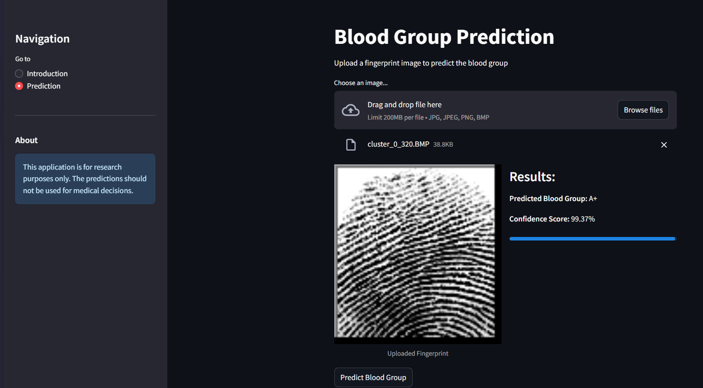

# Blood Group Prediction from Fingerprint Images using PyTorch CNN

This project implements a Convolutional Neural Network (CNN) using PyTorch to predict blood groups from fingerprint images. The system is deployed as a web application with a RESTful API backend and a Streamlit frontend interface.

## 🚀 Features

- Deep learning-based blood group prediction from fingerprint images
- RESTful API for model inference
- User-friendly web interface built with Streamlit
- Containerized application using Docker
- Pre-trained model weights included

## 🛠️ Technical Architecture

- **Backend**: Python-based REST API
- **Frontend**: Streamlit web application
- **Model**: PyTorch CNN architecture
- **Deployment**: Docker containerization
- **Model Weights**: Stored in `best_fingerprint_model.pth`

## 📋 Prerequisites

- Python 3.12 or higher
- Docker
- PyTorch
- Streamlit

## 🔧 Installation & Setup

1. Clone the repository:
```bash
git clone [your-repository-url]
cd [repository-name]
```

2. Build the Docker image:
```bash
docker build -t fingerprint-prediction .
```

3. Run the container:
```bash
docker run -p 8501:8501 fingerprint-prediction
```

## 🔍 Usage

1. Access the web interface at `http://localhost:8501`
2. Upload a fingerprint image through the Streamlit interface
3. Get the predicted blood group instantly

## 📁 Project Structure

```
.
├── app.py              # Streamlit frontend application
├── api/                # REST API implementation
├── models/             # Model architecture and utilities
│   └── best_fingerprint_model.pth  # Trained model weights
├── Dockerfile         # Docker configuration
├── requirements.txt   # Python dependencies
└── README.md         # Project documentation
```

## 🔌 API Endpoints

The API is available at `[base-url]/api/v1/` with the following endpoints:

- `POST /predict`: Submit a fingerprint image for blood group prediction
  - Input: Multipart form data with image file
  - Output: JSON response with predicted blood group

## 🛠️ Development

To set up the development environment:

1. Create a virtual environment:
```bash
python -m venv venv
source venv/bin/activate  # On Windows: venv\Scripts\activate
```

2. Install dependencies:
```bash
pip install -r requirements.txt
```

3. Run the application locally:
```bash
streamlit run app.py
```

## 🤝 Contributing

1. Fork the repository
2. Create your feature branch (`git checkout -b feature/AmazingFeature`)
3. Commit your changes (`git commit -m 'Add some AmazingFeature'`)
4. Push to the branch (`git push origin feature/AmazingFeature`)
5. Open a Pull Request


## 👥 Authors

P Bhuvan Kambley

